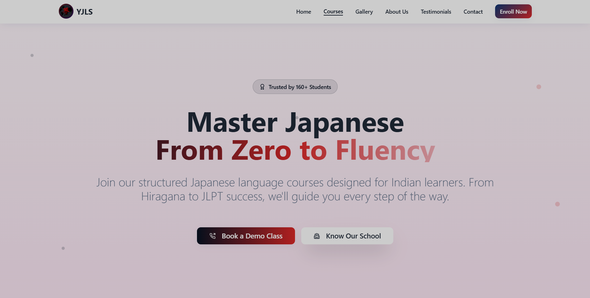

# Yume Japanese Language School 🎌

**The official website for Yume Japanese Language School, Kolkata.**  
Learn Japanese with JLPT N5-N3 & NAT preparation courses in small batches.

  

## ✨ Features

- 🎯 **Responsive Design** - Mobile-first approach
- 📱 **Modern UI** - Built with Tailwind CSS & shadcn/ui components
- 🚀 **Fast Loading** - Vite + React with optimized performance
- 📂 **Gallery** - Student events, classes, and achievements
- 💬 **Testimonials** - Real student success stories
- 🔍 **SEO Optimized** - Meta tags, structured data, sitemap
- 🗺️ **Google Maps Integration** - Easy location finding

## 🛠️ Tech Stack

| Frontend | Styling | UI Components | Tools |
|----------|---------|---------------|-------|
| React 18 | Tailwind CSS | shadcn/ui | Vite |
| TypeScript | | Radix UI | React Router |
| React Query | | Framer Motion | React Helmet Async |

